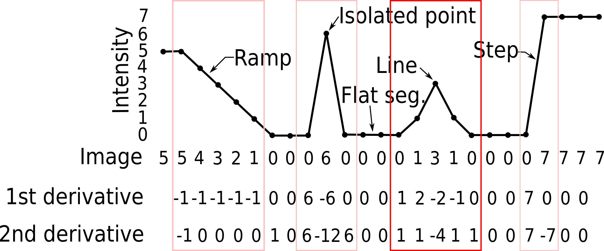

## Harris Corner Detector

---

The Harris Corner Detector is a keypoint localization mathod used in computer vision to identify interest points or corners in an image. Developed by Chris Harris and Mike Stephens in 1988, the Harris Corner Detector is particularly useful for feature detection and matching, which are crucial tasks in various computer vision applications, such as object recognition, image stitching, and tracking.

If we consider an image as a 2-D matrix, and let the value of each element representing the intensity of each pixel (normally, for a gray-scale image, the range of value is between 0 and 255. i.e., 0 represents black and 255 represents white.), then we can extract features by taking the derivative of the image and observing the intensity change in horizontal and vertical directions. Here is an illustrative picture showing how we can achieve this in a 1-D scenario:

